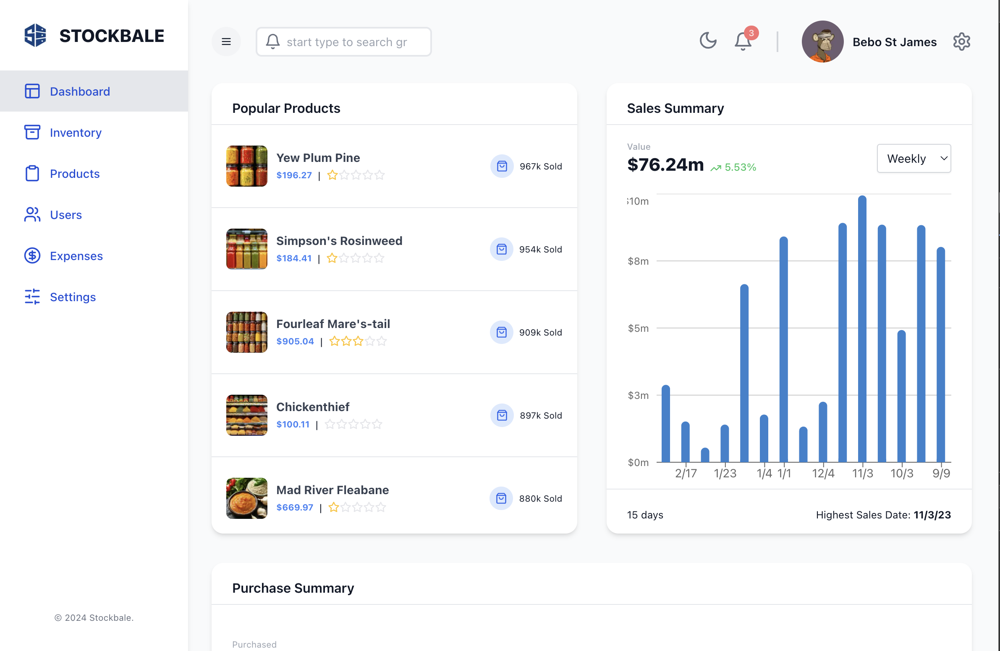

 # Stockbale - Inventory Management System

Stockbale is a modern, full-stack inventory management system built with Next.js and Express. It provides businesses with a robust solution for tracking products, managing stock levels, monitoring sales, and analyzing expenses.

## Features

- **Real-time Dashboard**
  - Sales analytics and trends
  - Popular products tracking
  - Purchase summaries
  - Expense monitoring

- **Inventory Management**
  - Product tracking
  - Stock level monitoring
  - Search and filter capabilities
  - Bulk actions support

- **User Management**
  - Role-based access control
  - User activity tracking
  - Profile management

- **Financial Tools**
  - Expense tracking
  - Sales analytics
  - Revenue monitoring
  - Category-based expense analysis

- **Modern UI/UX**
  - Responsive design
  - Dark/Light mode
  - Interactive charts and graphs
  - Intuitive navigation

## Tech Stack

### Frontend
- Next.js 14
- TypeScript
- Redux Toolkit (State Management)
- Tailwind CSS (Styling)
- Material-UI Data Grid
- Recharts (Data Visualization)
- Lucide React (Icons)

### Backend
- Express.js
- Prisma (ORM)
- PostgreSQL
- TypeScript

## Getting Started

### Prerequisites
- Node.js (v18 or higher)
- npm or yarn
- PostgreSQL database

### Installation

1. Clone the repository